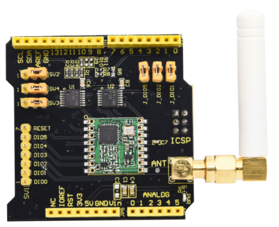
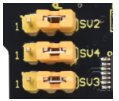
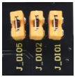
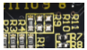
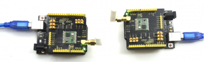
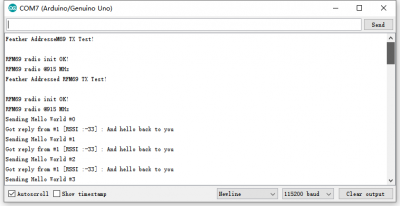
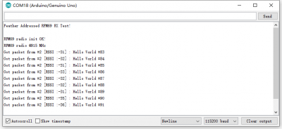

# KS0515 Keyestudio FSK Wireless Shield RFM69HCW 868mhz(Black and Eco-friendly)



## 1. Description

Keyestudio FSK wireless shield is long range transceiver based on Arduino open source platform . It can send data and reach extremely long ranges at low data-rates, featuring high interference immunity and low current consumption in communication.

In addition, it can be applied to multiple wireless sensors and network applications, such as irrigation systems, smart metering, smart cities, smart phone detection, building automation, and so on.

It also supports FSK mode like WMBus and IEEE802.15.4g system. Simultaneously, this board delivers exceptional phase noise, selectivity, receiver linearity and IIP3 for significantly lower current consumption than competing devices.

## 2. Features

- Compatible with 3.3v or 5v I/O Arduino Board.
- Frequency Band: 868 MHZ
- Low power consumption
- Compatible with Arduino Leonardo, Uno, Mega, DUE
- External Antenna via I-Pex connector

The communication distance is 200-500 meters in an outdoor barrier-free state, and the maximum distance after adjustment with a directional antenna is 5000 meters.

## 3. Specification

Jumper caps are for setting SPI communication ports, as shown below:

- CLK is connected to ICSP port CLK；
- DI is linked with ICSP port MOSI；
- DO is attached to MISO ICSP port MISO



If jumper caps are connected to 1, which means that CLK is attached to Arduino D13；

DI is connected to Arduino D11；

DO is linked with Arduino D12.



Chip DIO5 is attached to Arduino D8； 

Chip DIO2 is linked with Arduino D7； 

Chip DIO1 is connected to Arduino D6.



We default that R9 is soldered to 0Ω resistor，which means that CS is connected to Arduino D10； 

If R10 is soldered to 0Ωresistor，which indicates that CS is connected to Arduino D5； 

If R11 is soldered to 0Ω resistor，which implies that CS is attached to Arduino D4.

## 4. Wiring Diagram



**Code download:**  [Resource](./Resource.7z)

**TX Code**

```c
#include <SPI.h>
#include <RH_RF69.h>
#include <RHReliableDatagram.h>
/************ Radio Setup ***************/

// Change to 434.0 or other frequency, must match RX's freq!
#define RF69_FREQ 915.0

// Where to send packets to!
#define DEST_ADDRESS   1
// change addresses for each client board, any number :)
#define MY_ADDRESS     2


#if defined (__AVR_ATmega32U4__) // Feather 32u4 w/Radio
  #define RFM69_CS      8
  #define RFM69_INT     7
  #define RFM69_RST     4
  #define LED           13
#endif

#if defined(ADAFRUIT_FEATHER_M0) // Feather M0 w/Radio
  #define RFM69_CS      8
  #define RFM69_INT     3
  #define RFM69_RST     4
  #define LED           13
#endif

#if defined (__AVR_ATmega328P__)  // Feather 328P w/wing
  #define RFM69_INT     2  // 
  #define RFM69_CS      10  //
  #define RFM69_RST     3  // "A"
  #define LED           13
#endif

#if defined(ESP8266)    // ESP8266 feather w/wing
  #define RFM69_CS      2    // "E"
  #define RFM69_IRQ     15   // "B"
  #define RFM69_RST     16   // "D"
  #define LED           0
#endif

#if defined(ESP32)    // ESP32 feather w/wing
  #define RFM69_RST     13   // same as LED
  #define RFM69_CS      33   // "B"
  #define RFM69_INT     27   // "A"
  #define LED           13
#endif

/* Teensy 3.x w/wing
#define RFM69_RST     9   // "A"
#define RFM69_CS      10   // "B"
#define RFM69_IRQ     4    // "C"
#define RFM69_IRQN    digitalPinToInterrupt(RFM69_IRQ )
*/
 
/* WICED Feather w/wing 
#define RFM69_RST     PA4     // "A"
#define RFM69_CS      PB4     // "B"
#define RFM69_IRQ     PA15    // "C"
#define RFM69_IRQN    RFM69_IRQ
*/

// Singleton instance of the radio driver
RH_RF69 rf69(RFM69_CS, RFM69_INT);

// Class to manage message delivery and receipt, using the driver declared above
RHReliableDatagram rf69_manager(rf69, MY_ADDRESS);


int16_t packetnum = 0;  // packet counter, we increment per xmission

void setup() 
{
  Serial.begin(115200);
  //while (!Serial) { delay(1); } // wait until serial console is open, remove if not tethered to computer

  pinMode(LED, OUTPUT);     
  pinMode(RFM69_RST, OUTPUT);
  digitalWrite(RFM69_RST, LOW);

  Serial.println("Feather Addressed RFM69 TX Test!");
  Serial.println();

  // manual reset
  digitalWrite(RFM69_RST, HIGH);
  delay(10);
  digitalWrite(RFM69_RST, LOW);
  delay(10);
  
  if (!rf69_manager.init()) {
    Serial.println("RFM69 radio init failed");
    while (1);
  }
  Serial.println("RFM69 radio init OK!");
  // Defaults after init are 434.0MHz, modulation GFSK_Rb250Fd250, +13dbM (for low power module)
  // No encryption
  if (!rf69.setFrequency(RF69_FREQ)) {
    Serial.println("setFrequency failed");
  }

  // If you are using a high power RF69 eg RFM69HW, you *must* set a Tx power with the
  // ishighpowermodule flag set like this:
  rf69.setTxPower(20, true);  // range from 14-20 for power, 2nd arg must be true for 69HCW

  // The encryption key has to be the same as the one in the server
  uint8_t key[] = { 0x01, 0x02, 0x03, 0x04, 0x05, 0x06, 0x07, 0x08,
                    0x01, 0x02, 0x03, 0x04, 0x05, 0x06, 0x07, 0x08};
  rf69.setEncryptionKey(key);
  
  pinMode(LED, OUTPUT);

  Serial.print("RFM69 radio @");  Serial.print((int)RF69_FREQ);  Serial.println(" MHz");
}


// Dont put this on the stack:
uint8_t buf[RH_RF69_MAX_MESSAGE_LEN];
uint8_t data[] = "  OK";

void loop() {
  delay(1000);  // Wait 1 second between transmits, could also 'sleep' here!

  char radiopacket[20] = "Hello World #";
  itoa(packetnum++, radiopacket+13, 10);
  Serial.print("Sending "); Serial.println(radiopacket);
  
  // Send a message to the DESTINATION!
  if (rf69_manager.sendtoWait((uint8_t *)radiopacket, strlen(radiopacket), DEST_ADDRESS)) {
    // Now wait for a reply from the server
    uint8_t len = sizeof(buf);
    uint8_t from;   
    if (rf69_manager.recvfromAckTimeout(buf, &len, 2000, &from)) {
      buf[len] = 0; // zero out remaining string
      
      Serial.print("Got reply from #"); Serial.print(from);
      Serial.print(" [RSSI :");
      Serial.print(rf69.lastRssi());
      Serial.print("] : ");
      Serial.println((char*)buf);     
      Blink(LED, 40, 3); //blink LED 3 times, 40ms between blinks
    } else {
      Serial.println("No reply, is anyone listening?");
    }
  } else {
    Serial.println("Sending failed (no ack)");
  }
}

void Blink(byte PIN, byte DELAY_MS, byte loops) {
  for (byte i=0; i<loops; i++)  {
    digitalWrite(PIN,HIGH);
    delay(DELAY_MS);
    digitalWrite(PIN,LOW);
    delay(DELAY_MS);
  }
}

```

**Receive Code**

```c
#include <SPI.h>
#include <RH_RF69.h>
#include <RHReliableDatagram.h>

/************ Radio Setup ***************/

// Change to 434.0 or other frequency, must match RX's freq!
#define RF69_FREQ 915.0

// who am i? (server address)
#define MY_ADDRESS     1


#if defined (__AVR_ATmega32U4__) // Feather 32u4 w/Radio
  #define RFM69_CS      8
  #define RFM69_INT     7
  #define RFM69_RST     4
  #define LED           13
#endif

#if defined(ADAFRUIT_FEATHER_M0) // Feather M0 w/Radio
  #define RFM69_CS      8
  #define RFM69_INT     3
  #define RFM69_RST     4
  #define LED           13
#endif

#if defined (__AVR_ATmega328P__)  // Feather 328P w/wing
  #define RFM69_INT     2  // 
  #define RFM69_CS      10  //
  #define RFM69_RST     3  // "A"
  #define LED           13
#endif

#if defined(ESP8266)    // ESP8266 feather w/wing
  #define RFM69_CS      2    // "E"
  #define RFM69_IRQ     15   // "B"
  #define RFM69_RST     16   // "D"
  #define LED           0
#endif

#if defined(ESP32)    // ESP32 feather w/wing
  #define RFM69_RST     13   // same as LED
  #define RFM69_CS      33   // "B"
  #define RFM69_INT     27   // "A"
  #define LED           13
#endif

/* Teensy 3.x w/wing
#define RFM69_RST     9   // "A"
#define RFM69_CS      10   // "B"
#define RFM69_IRQ     4    // "C"
#define RFM69_IRQN    digitalPinToInterrupt(RFM69_IRQ )
*/
 
/* WICED Feather w/wing 
#define RFM69_RST     PA4     // "A"
#define RFM69_CS      PB4     // "B"
#define RFM69_IRQ     PA15    // "C"
#define RFM69_IRQN    RFM69_IRQ
*/

// Singleton instance of the radio driver
RH_RF69 rf69(RFM69_CS, RFM69_INT);

// Class to manage message delivery and receipt, using the driver declared above
RHReliableDatagram rf69_manager(rf69, MY_ADDRESS);


int16_t packetnum = 0;  // packet counter, we increment per xmission

void setup() 
{
  Serial.begin(115200);
  //while (!Serial) { delay(1); } // wait until serial console is open, remove if not tethered to computer

  pinMode(LED, OUTPUT);     
  pinMode(RFM69_RST, OUTPUT);
  digitalWrite(RFM69_RST, LOW);

  Serial.println("Feather Addressed RFM69 RX Test!");
  Serial.println();

  // manual reset
  digitalWrite(RFM69_RST, HIGH);
  delay(10);
  digitalWrite(RFM69_RST, LOW);
  delay(10);
  
  if (!rf69_manager.init()) {
    Serial.println("RFM69 radio init failed");
    while (1);
  }
  Serial.println("RFM69 radio init OK!");
  // Defaults after init are 434.0MHz, modulation GFSK_Rb250Fd250, +13dbM (for low power module)
  // No encryption
  if (!rf69.setFrequency(RF69_FREQ)) {
    Serial.println("setFrequency failed");
  }

  // If you are using a high power RF69 eg RFM69HW, you *must* set a Tx power with the
  // ishighpowermodule flag set like this:
  rf69.setTxPower(20, true);  // range from 14-20 for power, 2nd arg must be true for 69HCW

  // The encryption key has to be the same as the one in the server
  uint8_t key[] = { 0x01, 0x02, 0x03, 0x04, 0x05, 0x06, 0x07, 0x08,
                    0x01, 0x02, 0x03, 0x04, 0x05, 0x06, 0x07, 0x08};
  rf69.setEncryptionKey(key);
  
  pinMode(LED, OUTPUT);

  Serial.print("RFM69 radio @");  Serial.print((int)RF69_FREQ);  Serial.println(" MHz");
}


// Dont put this on the stack:
uint8_t data[] = "And hello back to you";
// Dont put this on the stack:
uint8_t buf[RH_RF69_MAX_MESSAGE_LEN];

void loop() {
  if (rf69_manager.available())
  {
    // Wait for a message addressed to us from the client
    uint8_t len = sizeof(buf);
    uint8_t from;
    if (rf69_manager.recvfromAck(buf, &len, &from)) {
      buf[len] = 0; // zero out remaining string
      
      Serial.print("Got packet from #"); Serial.print(from);
      Serial.print(" [RSSI :");
      Serial.print(rf69.lastRssi());
      Serial.print("] : ");
      Serial.println((char*)buf);
      Blink(LED, 40, 3); //blink LED 3 times, 40ms between blinks

      // Send a reply back to the originator client
      if (!rf69_manager.sendtoWait(data, sizeof(data), from))
        Serial.println("Sending failed (no ack)");
    }
  }
}


void Blink(byte PIN, byte DELAY_MS, byte loops) 
{
  for (byte i=0; i<loops; i++)  {
    digitalWrite(PIN,HIGH);
    delay(DELAY_MS);
    digitalWrite(PIN,LOW);
    delay(DELAY_MS);
  }
}
```


## 5. Test Result

Stack two expansion boards on two control boards and respectively connect them to two computers. The two control boards are used to send and receive code and shields start wireless communication. As shown below:



Open serial monitor, set baud rate 115200, as shown below:

